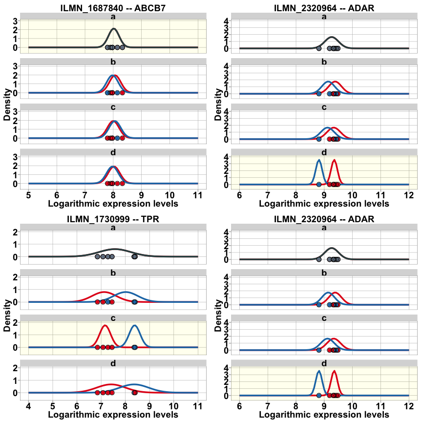
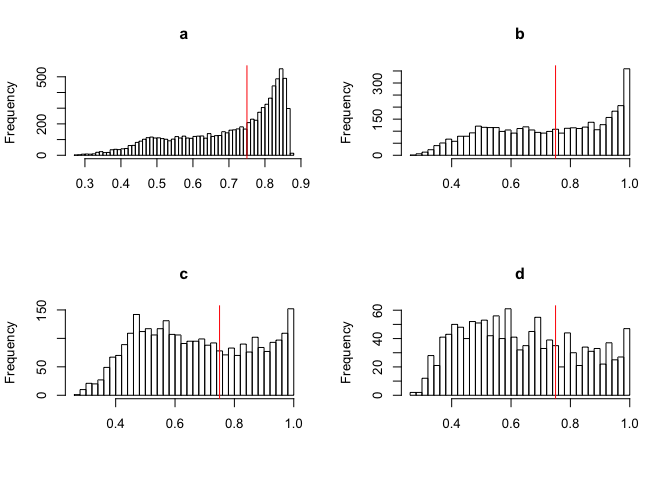

Reproducible script for the publication
================
Weinholdt Claus
2018-24-4

Weinholdt et. al **Analysis of genes regulated by isoforms of the epidermal growth factor receptor in a glioblastoma cell line**

Contents
--------

-   [Getting started](#start)
    -   [Installation](#Installation)
    -   [Data](#data)
-   [Visualization](#vis)

<a name="start"></a>Getting started
-----------------------------------

### <a name="Installation"></a>Installation of necessary packages

Install and load packages containing the functions for the analyses

``` r
install.packages("devtools")
devtools::install_github("BGSC")
library(BGSC)
```

### <a name="data"></a> Load expression data

Loading CXXX data

``` r
data(ExpData)
```

### normalize Data

``` r
normData <- normalizeExpData()
```

    ## genes with detection pval <= 0.05 --> 16742 of 47322

### calulate logLik for class Data

``` r
Lsets <- get.Lset()
normDataLogLik <- logLikelihoodOfnormData(normData$E)
rownames(ALL.MUs) <- rownames(normData$E)
colnames(ALL.MUs) <- c('a0','a1','b0','b1','c0','c1','d0','d1')
rownames(ALL.VARs) <- rownames(normData$E)
colnames(ALL.VARs) <- c('a','b','c','d')
```

#### Density plots with fitted normal distribution



### calulate BIC from logLik

``` r
  npar <- sapply(Lsets, function(x) sum(!sapply(x,is.null ) )) + 1  ## number parapeters for LogLilk -> mean + var 
  k <-  sapply(Lsets, function(x) sum( sapply(x,length) ))
  normDataBIC <- get.IC(normDataLogLik , npar, k , IC = 'BIC')
  BICminInd <- apply( normDataBIC,MARGIN = 1, FUN = minIndex)
  print(table(BICminInd))
```

    ## BICminInd
    ##    1    2    3    4 
    ## 3444 5644 5018 2636

### calulate Posterior from BIC

``` r
  normDataPosterior <- get.Posterior( normDataBIC ,Pis = c(0.7,0.1,0.1,0.1))
  POSTmaxInd <- apply(normDataPosterior, MARGIN = 1 ,FUN = maxIndex)
  print(table(POSTmaxInd))
```

    ## POSTmaxInd
    ##    1    2    3    4 
    ## 8453 3820 3141 1328

### get gene classes

``` r
  PostClass <- get.gene.classes(data = normDataPosterior,indexing = "max",filter = 0.75, DoPlot = TRUE)
```



    ##           a    b    c    d
    ## ALL    8453 3820 3141 1328
    ## Filter 4209 1870 1139  391

Comapre Illumina data with RT-qPCR
----------------------------------

``` r
 ### compare to qPCR ----------------------------------------------------------------------
    MeanFoldChangeClass <- get.log2Mean.and.log2FC(normData = normData)
    qCPRdataC <- getQPCR()
    
    IDs.dt <- data.table::data.table(normData$genes,keep.rownames = T,key = 'rn')
    IDs.dt.c <- IDs.dt[rownames(PostClass$resFilter$c),]
    data.table::setkey(IDs.dt.c,'SYMBOL')
    
    qgenesIDs <- lapply(qCPRdataC$rn, function(qg) as.character(IDs.dt.c[qg,][['rn']]) )
    names(qgenesIDs) <- qCPRdataC$rn
  
    print(do.call(c,qgenesIDs))
```

    ##        ALDH4A1         CKAP2L          CLCA2          GALNS          ROCK1 
    ## "ILMN_1696099" "ILMN_1751776" "ILMN_1803236" "ILMN_1737949" "ILMN_1808768" 
    ##            TPR 
    ## "ILMN_1730999"

Barplot mean expression data of Illumina
----------------------------------------


| Gene    | ExpID         | Set |      Mean|     stderr| pid                    |
|:--------|:--------------|:----|---------:|----------:|:-----------------------|
| ALDH4A1 | ILMN\_1696099 | c0  |  7.606812|  0.1630896| ALDH4A1::ILMN\_1696099 |
| ALDH4A1 | ILMN\_1696099 | c1  |  6.370315|  0.0700448| ALDH4A1::ILMN\_1696099 |
| CKAP2L  | ILMN\_1751776 | c0  |  7.785235|  0.1648180| CKAP2L::ILMN\_1751776  |
| CKAP2L  | ILMN\_1751776 | c1  |  8.996717|  0.1076403| CKAP2L::ILMN\_1751776  |
| CLCA2   | ILMN\_1803236 | c0  |  7.588690|  0.2048727| CLCA2::ILMN\_1803236   |
| CLCA2   | ILMN\_1803236 | c1  |  6.337739|  0.0678303| CLCA2::ILMN\_1803236   |
| GALNS   | ILMN\_1737949 | c0  |  6.845981|  0.1115314| GALNS::ILMN\_1737949   |
| GALNS   | ILMN\_1737949 | c1  |  5.968122|  0.0431519| GALNS::ILMN\_1737949   |
| ROCK1   | ILMN\_1808768 | c0  |  5.121343|  0.0738092| ROCK1::ILMN\_1808768   |
| ROCK1   | ILMN\_1808768 | c1  |  5.905558|  0.0496243| ROCK1::ILMN\_1808768   |
| TPR     | ILMN\_1730999 | c0  |  7.163142|  0.1314566| TPR::ILMN\_1730999     |
| TPR     | ILMN\_1730999 | c1  |  8.383446|  0.0213815| TPR::ILMN\_1730999     |

Barplot comparison of Illumina data and RT-qPCR Log2-fold change
----------------------------------------------------------------


| Gene    | ExpID         | Set      |          FC|     stderr| pid                    |
|:--------|:--------------|:---------|-----------:|----------:|:-----------------------|
| ALDH4A1 | ILMN\_1696099 | Illumina |  -1.2364964|  0.1630896| ALDH4A1::ILMN\_1696099 |
| ALDH4A1 | ILMN\_1696099 | RT-qPCR  |  -0.8431039|  0.4848167| ALDH4A1::ILMN\_1696099 |
| CKAP2L  | ILMN\_1751776 | Illumina |   1.2114816|  0.1648180| CKAP2L::ILMN\_1751776  |
| CKAP2L  | ILMN\_1751776 | RT-qPCR  |   1.0941976|  0.2285730| CKAP2L::ILMN\_1751776  |
| CLCA2   | ILMN\_1803236 | Illumina |  -1.2509517|  0.2048727| CLCA2::ILMN\_1803236   |
| CLCA2   | ILMN\_1803236 | RT-qPCR  |  -0.9681039|  0.3435681| CLCA2::ILMN\_1803236   |
| GALNS   | ILMN\_1737949 | Illumina |  -0.8778586|  0.1115314| GALNS::ILMN\_1737949   |
| GALNS   | ILMN\_1737949 | RT-qPCR  |  -0.4347706|  0.2874267| GALNS::ILMN\_1737949   |
| ROCK1   | ILMN\_1808768 | Illumina |   0.7842151|  0.0738092| ROCK1::ILMN\_1808768   |
| ROCK1   | ILMN\_1808768 | RT-qPCR  |   0.8206860|  0.3403608| ROCK1::ILMN\_1808768   |
| TPR     | ILMN\_1730999 | Illumina |   1.2203032|  0.1314566| TPR::ILMN\_1730999     |
| TPR     | ILMN\_1730999 | RT-qPCR  |   1.0850383|  0.3248168| TPR::ILMN\_1730999     |

### How expression pattern von group c should look like

    ## [1] "A"


### How expression pattern of compare genes


Note that the `echo = FALSE` parameter was added to the code chunk to prevent printing of the R code that generated the plot.
