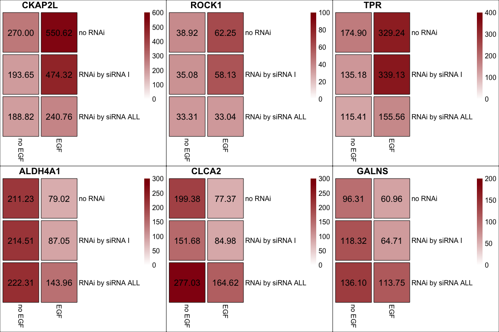

Reproducible script for the publication
================
Weinholdt Claus
2019-04-19

<!--   html_document:
    toc: true
    theme: united
  pdf_document:
    toc: true
    highlight: zenburn -->
Claus Weinholdt, Henri Wichmann, Johanna Kotrba, David H. Ardell, Matthias Kappler, Alexander W. Eckert, Dirk Vordermark and Ivo Grosse **Prediction of regulatory targets of alternative isoforms of the epidermal growth factor receptor in a glioblastoma cell line** BMC Bioinformatics (2019)

Contents
--------

-   [Getting started](#start)
    -   [Installation](#Installation)
    -   [Data](#data)
-   [Analysis](#Analysis)
    -   [Normalizing Illumina BeadChips expression data](#Normalizing)
        -   [Schematic Expression Pattern](#SchematicE)
    -   [Calculating the log-likelihood for each gene in each group](#CalculatingLik)
    -   [Calculating Bayesian Information Criterion of the log-likelihood](#BIC)
    -   [Approximating posterior by the Bayesian Information Criterion](#Posterior)
-   [Identification of genes belonging to group c](#Compare)
    -   [Examples for group c](#GrC)
    -   [Fold changes plot of Illumina data vs RT-qPCR](#FCplot)

<a name="start"></a>Getting started
-----------------------------------

### <a name="Installation"></a>Installation of necessary packages

Install and load packages containing the functions for the analyses

``` r
install.packages("devtools")
devtools::install_github("GrosseLab/BGSC")
library(BGSC)
```

### <a name="data"></a> Load expression data

<!-- Loading data  -->
``` r
data(ExpData)
```

<a name="Analysis"></a> Run analysis
------------------------------------

### <a name="Normalizing"></a> Normalizing Illumina BeadChips expression data

We use the function *neqc* function from the *limma* package which was developed for normalizing Illumina BeadChips data. The *neqc* function performs background correction using negative control probes followed by quantile normalization using negative and positive control probes. The *Illumina GenomeStudio* calculates and reports a detection p-value, which represents the confidence that a given transcript is expressed above background defined by negative control probes. For further analysis, we used only those probes for which the detection p-values for all six probes was below 0.05.

``` r
normData <- normalizeExpData(set = 'SF767')
```

    ## [1] "Dataset is SF767"

    ## genes with detection pval <= 0.05 in 6 of 6 Samples --> 16742 of 47322

#### <a name="SchematicE"></a> Schematic Expression Pattern

We define that:

-   Genes of the group *a* are never regulated by EGF, whereas genes of groups b-d are regulated by EGF.
-   Genes of the group *b* are regulated by EGF only through other receptors besides EGFR isoforms.
-   Genes of the group *c* are regulated by EGFR isoforms II-IV and not by other receptors.
-   Genes of the group *d* are regulated by EGFR isoform I and not other receptors or EGFR isoforms II-IV.

<!--  Based on this reduction, we can now formulate the goal of this work as the identification of putative target genes regulated by EGFR isoforms II-IV and not by other receptors or more crisply as the goal of identifying genes of group $c$. -->


### <a name="CalculatingLik"></a> Calculating the log-likelihood for each gene in each group (a, b, c, and d)

Experimental design where the rows present the RNAi treatment -- without RNAi, RNAi against EGFR splice variant I (siRNA<sub>*I*</sub>), and RNAi against all EGFR splice variants (siRNA<sub>*A**L**L*</sub>) -- and the columns present the EGF treatment. The six corresponding logarithmic expression values per gene are denoted by *x*<sub>1</sub>, …, *x*<sub>6</sub>.

|                                   | no EGF          | EGF             |
|-----------------------------------|-----------------|-----------------|
| no RNAi                           | *x*<sub>1</sub> | *x*<sub>2</sub> |
| RNAi by siRNA<sub>*I*</sub>       | *x*<sub>3</sub> | *x*<sub>4</sub> |
| RNAi by siRNA<sub>*A**L**L*</sub> | *x*<sub>5</sub> | *x*<sub>6</sub> |

For group *a* we assume that all six expression levels stem from the same normal distribution. In this case, the mean *μ* and standard deviation *σ* of this normal distribution (black) is equal to *μ* and *σ* of the six expression levels. For gene groups b-d, we assume that all six expression levels stems from a mixture of two normal distributions with independent means *μ*<sub>0</sub> and *μ*<sub>1</sub>, and one pooled standard deviation *σ*. For gene groups *b* − *d*, we assume that the expression levels \[*x*<sub>1</sub>, *x*<sub>3</sub>, and *x*<sub>5</sub>\], \[*x*<sub>1</sub>, *x*<sub>3</sub>, *x*<sub>4</sub>, and *x*<sub>5</sub>\], and \[*x*<sub>1</sub>, *x*<sub>3</sub>, *x*<sub>4</sub>, *x*<sub>5</sub>, and *x*<sub>6</sub>\] stem from the normal distribution based on *μ*<sub>0</sub> (red), respectively. For gene groups *b* − *d*, we assume that the expression levels \[*x*<sub>2</sub>, *x*<sub>4</sub>, and *x*<sub>6</sub>\], \[*x*<sub>2</sub> and *x*<sub>4</sub>\], and \[*x*<sub>2</sub>\] stem from the normal distribution based on *μ*<sub>1</sub> (blue), respectively.

``` r
Lsets <- get.Lset() #getting a list with the schematic expression pattern
normDataLogLikData <- logLikelihoodOfnormData(normData$E) #calc loglik for each gene in each group
normDataLogLik <- normDataLogLikData[['logL']] 
ALL.MUs  <- normDataLogLikData[['ALL.MUs']] #table with mean for each gene in each group
ALL.VARs <- normDataLogLikData[['ALL.VARs']] #table with var for each gene in each group 
```

#### <a name="ProbabilityDens"></a> Probability density plots of the normal distributions

As an example, we show for each group a gene having the minimum log-likelihood. For the groups *a* − *d*, the examples are ABCB7, ACSL1, TPR, and ADAR, respectively. In each figure, we plot the probability density of the normal distribution for the group *a* as a black curve and mark the six log2-expression values with black circles. For groups *b* − *d*, we plot with red and blue curves the probability densities of the normal distributions and mark the six log2-expression values with circles, which are colored according to classes for class 0 in red and for class 1 in blue.

``` r
GeneExample <- c('ILMN_1687840','ILMN_1684585','ILMN_1730999','ILMN_2320964') 
names(GeneExample) <- c('g1','g2','g3','g4')
tmpPlot <- purrr::map2(GeneExample,c('a','b','c','d'),function(.x,.y) Density.NV.fit.plot(id = .x ,normData, ALL.MUs, ALL.VARs, useGroup = .y ,DOplot = FALSE) )
grid.arrange( tmpPlot$g1 + theme(legend.position = "none"),
              tmpPlot$g2 + theme(legend.position = "none"),
              tmpPlot$g3 + theme(legend.position = "none"),
              tmpPlot$g4 + theme(legend.position = "none") ,ncol = 2,nrow = 2,
              bottom = textGrob("The group having the minimum log-likelihood is highlighted with yellow.",gp = gpar(fontsize = 12,font = 1))
)              
```


### <a name="BIC"></a> Calculating Bayesian Information Criterion of the log-likelihood

Performing classification through model selection based on minimum log-likelihood is problematic when the number of free model parameters is not identical among all models under comparison. Here, model *a* has two free model parameters, while models *b*, *c*, and *d* have three. Hence, a naive classification based on a minimum log-likelihood criterion would give a spurious advantage to models *b*, *c*, and *d* with three free model parameters over model *a* with only two free parameters. To eliminate that spurious advantage, we compute marginal likelihoods *p*(*x*|*z*) using the approximation of Schwarz et al. commonly referred to as Bayesian Information Criterion.

``` r
npar <- sapply(Lsets, function(x) sum(!sapply(x,is.null ) )) + 1  ## number parameters for log-likelihood -> mean + var 
k <-  sapply(Lsets, function(x) sum( sapply(x,length) )) ## number of samples
print(rbind(npar,k))
```

    ##      a b c d
    ## npar 2 3 3 3
    ## k    6 6 6 6

``` r
normDataBIC <- get.IC(normDataLogLik , npar, k , IC = 'BIC')
```

    ## Number of genes assigned to group with the minimal Bayesian Information Criterion

    ##                             a    b    c    d
    ## #genes assigned to group 3446 5646 5015 2635

### <a name="Posterior"></a> Approximating posterior by the Bayesian Information Criterion

We assume that 70% of all genes are not regulated by EGF, so we define the prior probability for group a by *p*(*a*)=0.70. Further, we assume that the remaining 30% of the genes fall equally in groups with EGF-regulation, so we define the prior probabilities for groups *b*, *c*, and *d* by *p*(*b*)=*p*(*c*)=*p*(*d*)=0.1. We can compute for *z* ∈ {*a*, *b*, *c*, *d*} the posterior *p*(*z*|*x*)≈*p*(*x*|*z*)⋅*p*(*z*) and then perform Bayesian model selection by assigning each gene to that group *z* with the maximum approximate posterior *p*(*z*|*x*). Further, we define as putative target genes for each group the subset of genes with an approximate posterior probability exceeding 0.75.

``` r
normDataPosterior <- get.Posterior( normDataBIC ,Pis = c(0.7,0.1,0.1,0.1))
POSTmaxInd <- apply(normDataPosterior, MARGIN = 1 ,FUN = maxIndex)
PostClass <- get.gene.group(data = normDataPosterior,indexing = "maximal",filter = 0.75, DoPlot = TRUE)
```

    ## [1] "Histograms of approximate posterior"


    ## [1] "Number of genes assigned to group with the maximal approximate posterior"
    ##                                             a    b    c    d
    ## #genes assigned to group                 8449 3822 3143 1328
    ## #genes assigned to group with Filter0.75 4209 1868 1140  390

<a name="Compare"></a> Identification of genes belonging to group c
-------------------------------------------------------------------

Genes of the group *c* are putative target genes regulated by EGFR isoforms II-IV and not by other receptors.

### <a name="GrC"></a> Examples for group c

After calculating the log2-fold change for group *c* by \[*μ*<sub>*c*1</sub> - *μ*<sub>*c*0</sub>\], we validated three up-regulated genes, namely CKAP2L, ROCK1, and TPR and three down-regulated genes, namely ALDH4A1, CLCA2, and GALNS.

``` r
    ### calculating mean and log2-fold change
    MeanFoldChangeClass <- get.log2Mean.and.log2FC(normData = normData) 
    
    ### load qPCR data
    data(qPCR_SF767, envir = environment()) 
    qgenes <-  c('CKAP2L','ROCK1','TPR','ALDH4A1','CLCA2','GALNS')
    comparative_qPCR <- list()
    qPCR_Mean <- qPCR_log2FC <- data.frame()
    for(n in qgenes){
      Ref_GAPDH <- as.double(qPCR_SF767[,'GAPDH'])
      tmp <-  as.double(qPCR_SF767[,n])
      comparative_qPCR[[n]] <- comparativeMethod_qPCR.analysis(Gene = tmp,Ref = Ref_GAPDH)
      comparative_qPCR[[n]]$CellLine <- qPCR_SF767$CellLine
      comparative_qPCR[[n]]$Treatment <- qPCR_SF767$Treatment
    } 
    SF.log2FC <- comparativeMethod_qPCR.RNAi.log2FC(comparative_qPCR)
    qCPRdataC <- SF.log2FC$dCT.C1C0
    data.table::setkey(qCPRdataC,Gene)
    
    ### annotation of gene examples
    IDs.dt <- data.table::data.table(normData$genes,keep.rownames = T,key = 'rn')
    IDs.dt.c <- IDs.dt[rownames(PostClass$resFilter$c),]
    data.table::setkey(IDs.dt.c,'SYMBOL')
    
    qgenesIDs <- lapply(as.character(qCPRdataC$Gene), function(qg) as.character(IDs.dt.c[qg,][['rn']]) )
    names(qgenesIDs) <- as.character(qCPRdataC$Gene)
```

<!-- 
### Schematic expression patterns of group c 
c0 is red and c1 is blue ... 

-->
#### Expression patterns

We show the normalized expression for the six genes of group *c*. The normalized expression is shown in a similar way as the `Schematic Expression Pattern`. For three up-regulated genes (CKAP2L, ROCK1, and TPR) the expression is higher for class *c*1 (dark red) and for three down-regulated genes (ALDH4A1, CLCA2, and GALNS) the expression is lower for class *c*1 (light red).



#### Probability density plots of the normal distributions

We show the probability density distributions of the log2-normalized expression for the six genes of group *c*. 

#### Barplot of Illumina expression data

We show the log2-normalized expression of the group *c* for the six genes.

    ##    GeneName   IlluminaID   meanC1   meanC0 log2-fold change
    ## 1:   CKAP2L ILMN_1751776 8.997306 7.786610        1.2106958
    ## 2:    ROCK1 ILMN_1808768 5.910558 5.129696        0.7808615
    ## 3:      TPR ILMN_1730999 8.384344 7.165260        1.2190839
    ## 4:  ALDH4A1 ILMN_1696099 6.373942 7.608376       -1.2344339
    ## 5:    CLCA2 ILMN_1803236 6.341448 7.590288       -1.2488407
    ## 6:    GALNS ILMN_1737949 5.972909 6.848607       -0.8756972


<!-- 

Table: Table 1

Gene      ExpID          Set        Mean      stderr  pid                   
--------  -------------  ----  ---------  ----------  ----------------------
CKAP2L    ILMN_1751776   c0     7.786610   0.1647013  CKAP2L::ILMN_1751776  
CKAP2L    ILMN_1751776   c1     8.997306   0.1075965  CKAP2L::ILMN_1751776  
ROCK1     ILMN_1808768   c0     5.129696   0.0735355  ROCK1::ILMN_1808768   
ROCK1     ILMN_1808768   c1     5.910558   0.0494527  ROCK1::ILMN_1808768   
TPR       ILMN_1730999   c0     7.165260   0.1312655  TPR::ILMN_1730999     
TPR       ILMN_1730999   c1     8.384344   0.0213682  TPR::ILMN_1730999     
ALDH4A1   ILMN_1696099   c0     7.608376   0.1628566  ALDH4A1::ILMN_1696099 
ALDH4A1   ILMN_1696099   c1     6.373942   0.0698691  ALDH4A1::ILMN_1696099 
CLCA2     ILMN_1803236   c0     7.590288   0.2046290  CLCA2::ILMN_1803236   
CLCA2     ILMN_1803236   c1     6.341448   0.0676563  CLCA2::ILMN_1803236   
GALNS     ILMN_1737949   c0     6.848607   0.1113025  GALNS::ILMN_1737949   
GALNS     ILMN_1737949   c1     5.972909   0.0430090  GALNS::ILMN_1737949   
-->
### <a name="FCplot"></a> Log2 fold changes of Illumina data vs RT-qPCR

We have found that the six log<sub>2</sub>-fold changes of the Illumina microarray expression levels, and those of the qPCR expression levels show a Pearson correlation coefficient of 0.99 (*p*-value = 0.00002). Therefore, we can suggest that the set of 1,140 genes might contain some further putative target genes of isoforms II-IV of the epidermal growth factor receptor in tumor cells.

    ## 
    ##  Pearson's product-moment correlation
    ## 
    ## data:  PlotDataFC[PlotDataFC$Set == "Microarray", "FC"] and PlotDataFC[PlotDataFC$Set == "qPCR", "FC"]
    ## t = 24.469, df = 4, p-value = 1.655e-05
    ## alternative hypothesis: true correlation is not equal to 0
    ## 95 percent confidence interval:
    ##  0.9684969 0.9996537
    ## sample estimates:
    ##       cor 
    ## 0.9966761


    ## data of "Comparison of Illumina data and RT-qPCR"-plot

| Gene    | Set        |     FC|  stderr|
|:--------|:-----------|------:|-------:|
| CKAP2L  | Microarray |   1.21|    0.16|
| CKAP2L  | qPCR       |   1.09|    0.23|
| ROCK1   | Microarray |   0.78|    0.07|
| ROCK1   | qPCR       |   0.82|    0.34|
| TPR     | Microarray |   1.22|    0.13|
| TPR     | qPCR       |   1.09|    0.32|
| ALDH4A1 | Microarray |  -1.23|    0.16|
| ALDH4A1 | qPCR       |  -0.84|    0.48|
| CLCA2   | Microarray |  -1.25|    0.20|
| CLCA2   | qPCR       |  -0.97|    0.34|
| GALNS   | Microarray |  -0.88|    0.11|
| GALNS   | qPCR       |  -0.43|    0.29|

    ## R version 3.4.1 (2017-06-30)
    ## Platform: x86_64-apple-darwin15.6.0 (64-bit)
    ## Running under: macOS  10.14.5
    ## 
    ## Matrix products: default
    ## BLAS: /Library/Frameworks/R.framework/Versions/3.4/Resources/lib/libRblas.0.dylib
    ## LAPACK: /Library/Frameworks/R.framework/Versions/3.4/Resources/lib/libRlapack.dylib
    ## 
    ## locale:
    ## [1] en_US.UTF-8/en_US.UTF-8/en_US.UTF-8/C/en_US.UTF-8/en_US.UTF-8
    ## 
    ## attached base packages:
    ## [1] grid      stats     graphics  grDevices utils     datasets  methods  
    ## [8] base     
    ## 
    ## other attached packages:
    ## [1] purrr_0.2.4         gtable_0.2.0        gridExtra_2.3      
    ## [4] ggplot2_2.2.1       BGSC_0.0.1.3        limma_3.34.8       
    ## [7] data.table_1.10.4-3
    ## 
    ## loaded via a namespace (and not attached):
    ##  [1] Rcpp_0.12.15       knitr_1.19         magrittr_1.5      
    ##  [4] MASS_7.3-48        munsell_0.4.3      colorspace_1.3-2  
    ##  [7] rlang_0.3.1        highr_0.6          stringr_1.2.0     
    ## [10] plyr_1.8.4         tools_3.4.1        plotrix_3.7       
    ## [13] htmltools_0.3.6    yaml_2.1.16        lazyeval_0.2.1    
    ## [16] rprojroot_1.3-2    digest_0.6.15      tibble_1.4.2      
    ## [19] RColorBrewer_1.1-2 rlist_0.4.6.1      evaluate_0.10.1   
    ## [22] rmarkdown_1.8      labeling_0.3       pheatmap_1.0.8    
    ## [25] stringi_1.1.6      pillar_1.1.0       compiler_3.4.1    
    ## [28] scales_0.5.0       backports_1.1.2

<!--  Note that the `echo = FALSE` parameter was added to the code chunk to prevent printing of the R code that generated the plot. -->
