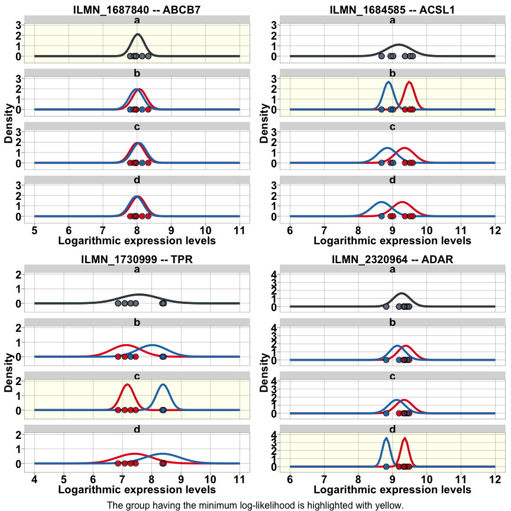

Reproducible script for the publication
================
Weinholdt Claus
2018-24-4

<!--   html_document:
    toc: true
    theme: united
  pdf_document:
    toc: true
    highlight: zenburn -->
Weinholdt et. al **Analysis of genes regulated by isoforms of the epidermal growth factor receptor in a glioblastoma cell line**

Contents
--------

-   [Getting started](#start)
    -   [Installation](#Installation)
    -   [Data](#data)
-   [Analysis](#Analysis)
-   [Comapre Illumina data with RT-qPCR](#Comapre)
    -   [Examples for group c](#GrC)
    -   [Fold changes plot of Illumina data vs RT-qPCR](#FCplot)

<a name="start"></a>Getting started
-----------------------------------

### <a name="Installation"></a>Installation of necessary packages

Install and load packages containing the functions for the analyses

``` r
install.packages("devtools")
devtools::install_github("BGSC")
library(BGSC)
```

### <a name="data"></a> Load expression data

<!-- Loading data  -->
``` r
data(ExpData)
```

<a name="Analysis"></a> Run analysis
------------------------------------

### Normalizing Illumina BeadChips expression data

We use the function *neqc* function from the *limma* package which is developed for normalizing Illumina BeadChips. *neqc* performs background correction using negative control probes followed by quantile normalization using negative and positive control probes. The *Illumina GenomeStudio* calculates and reports a detection p-value, which represents the confidence that a given transcript is expressed above the background defined by negative control probes. For further analysis, we used only the those probes for which the detection p-values for all six probes were below 0.05.

``` r
normData <- normalizeExpData()
```

    ## genes with detection pval <= 0.05 in 6 of 6 Samples --> 16742 of 47322

### Calulating the log likelihood for each gene in each class (*a, b, c, and d*)

We define that: \* Genes of group *a* are never regulated by EGF, whereas genes of groups *b* − *d* are regulated by EGF. \* Genes of group *b* are regulated by EGF only through other receptors besides EGFR isoforms. \* Genes of group *c* are regulated by EGFR isoforms II - IV and not by other receptors. \* Genes of group *d* are regulated by EGFR isoform I and not other receptors or EGFR isoforms II - IV. <!--  Based on this reduction, we can now formulate the goal of this work as the identification of putative target genes regulated by EGFR isoforms II - IV and not by other receptors or more crisply as the goal of identifying genes of group $c$. -->

``` r
Lsets <- get.Lset()
normDataLogLik <- logLikelihoodOfnormData(normData$E)
```

#### Schematic Expression Pattern

 \#\#\#\# Density plots with fitted normal distribution

``` r
GeneExample <- c('ILMN_1687840','ILMN_1684585','ILMN_1730999','ILMN_2320964') 
names(GeneExample) <- c('a','b','c','d')
tmpPlot <- purrr::map2(GeneExample,names(GeneExample),function(.x,.y) Density.NV.fit.plot(id = .x ,normData,useGroup = .y ,DOplot = FALSE) )
grid.arrange(tmpPlot$a + theme(legend.position = "none"),
             tmpPlot$b + theme(legend.position = "none"),
             tmpPlot$c + theme(legend.position = "none"),
             tmpPlot$d + theme(legend.position = "none") ,ncol=2,nrow=2)
```



### calulate BIC from logLik

``` r
  npar <- sapply(Lsets, function(x) sum(!sapply(x,is.null ) )) + 1  ## number parapeters for LogLilk -> mean + var 
  k <-  sapply(Lsets, function(x) sum( sapply(x,length) ))
  normDataBIC <- get.IC(normDataLogLik , npar, k , IC = 'BIC')
  BICminInd <- apply( normDataBIC,MARGIN = 1, FUN = minIndex)
  print(table(BICminInd))
```

    ## BICminInd
    ##    1    2    3    4 
    ## 3446 5646 5015 2635

### calulate Posterior from BIC

``` r
  normDataPosterior <- get.Posterior( normDataBIC ,Pis = c(0.7,0.1,0.1,0.1))
  POSTmaxInd <- apply(normDataPosterior, MARGIN = 1 ,FUN = maxIndex)
  print(table(POSTmaxInd))
```

    ## POSTmaxInd
    ##    1    2    3    4 
    ## 8449 3822 3143 1328

### get gene classes

``` r
  PostClass <- get.gene.classes(data = normDataPosterior,indexing = "max",filter = 0.75, DoPlot = TRUE)
```


    ##           a    b    c    d
    ## ALL    8449 3822 3143 1328
    ## Filter 4209 1868 1140  390

<a name="Comapre"></a> Comapre Illumina data with RT-qPCR
---------------------------------------------------------

### <a name="GrC"></a> Examples for group c

``` r
    MeanFoldChangeClass <- get.log2Mean.and.log2FC(normData = normData)
    qCPRdataC <- getQPCR()
    
    IDs.dt <- data.table::data.table(normData$genes,keep.rownames = T,key = 'rn')
    IDs.dt.c <- IDs.dt[rownames(PostClass$resFilter$c),]
    data.table::setkey(IDs.dt.c,'SYMBOL')
    
    qgenesIDs <- lapply(qCPRdataC$rn, function(qg) as.character(IDs.dt.c[qg,][['rn']]) )
    names(qgenesIDs) <- qCPRdataC$rn
  
    print(do.call(c,qgenesIDs))
```

    ##        ALDH4A1         CKAP2L          CLCA2          GALNS          ROCK1 
    ## "ILMN_1696099" "ILMN_1751776" "ILMN_1803236" "ILMN_1737949" "ILMN_1808768" 
    ##            TPR 
    ## "ILMN_1730999"

### Schematic expression patterns of group c

c0 is red and c1 is blue ...


### Expression patterns


### Barplot mean expression data of Illumina

By summarizing the the expression of c0 and c1 we get ... with std-err


<!-- 

Table: Table 1

Gene      ExpID          Set        Mean      stderr  pid                   
--------  -------------  ----  ---------  ----------  ----------------------
ALDH4A1   ILMN_1696099   c0     7.608376   0.1628566  ALDH4A1::ILMN_1696099 
ALDH4A1   ILMN_1696099   c1     6.373942   0.0698691  ALDH4A1::ILMN_1696099 
CKAP2L    ILMN_1751776   c0     7.786610   0.1647013  CKAP2L::ILMN_1751776  
CKAP2L    ILMN_1751776   c1     8.997306   0.1075965  CKAP2L::ILMN_1751776  
CLCA2     ILMN_1803236   c0     7.590288   0.2046290  CLCA2::ILMN_1803236   
CLCA2     ILMN_1803236   c1     6.341448   0.0676563  CLCA2::ILMN_1803236   
GALNS     ILMN_1737949   c0     6.848607   0.1113025  GALNS::ILMN_1737949   
GALNS     ILMN_1737949   c1     5.972909   0.0430090  GALNS::ILMN_1737949   
ROCK1     ILMN_1808768   c0     5.129696   0.0735355  ROCK1::ILMN_1808768   
ROCK1     ILMN_1808768   c1     5.910558   0.0494527  ROCK1::ILMN_1808768   
TPR       ILMN_1730999   c0     7.165260   0.1312655  TPR::ILMN_1730999     
TPR       ILMN_1730999   c1     8.384344   0.0213682  TPR::ILMN_1730999     
-->
### <a name="FCplot"></a> Log2 fold changes of Illumina data vs RT-qPCR


| Gene    | ExpID         | Set        |          FC|     stderr| pid                    |
|:--------|:--------------|:-----------|-----------:|----------:|:-----------------------|
| ALDH4A1 | ILMN\_1696099 | Microarray |  -1.2344339|  0.1628566| ALDH4A1::ILMN\_1696099 |
| ALDH4A1 | ILMN\_1696099 | qPCR       |  -0.8431039|  0.4848167| ALDH4A1::ILMN\_1696099 |
| CKAP2L  | ILMN\_1751776 | Microarray |   1.2106958|  0.1647013| CKAP2L::ILMN\_1751776  |
| CKAP2L  | ILMN\_1751776 | qPCR       |   1.0941976|  0.2285730| CKAP2L::ILMN\_1751776  |
| CLCA2   | ILMN\_1803236 | Microarray |  -1.2488407|  0.2046290| CLCA2::ILMN\_1803236   |
| CLCA2   | ILMN\_1803236 | qPCR       |  -0.9681039|  0.3435681| CLCA2::ILMN\_1803236   |
| GALNS   | ILMN\_1737949 | Microarray |  -0.8756972|  0.1113025| GALNS::ILMN\_1737949   |
| GALNS   | ILMN\_1737949 | qPCR       |  -0.4347706|  0.2874267| GALNS::ILMN\_1737949   |
| ROCK1   | ILMN\_1808768 | Microarray |   0.7808615|  0.0735355| ROCK1::ILMN\_1808768   |
| ROCK1   | ILMN\_1808768 | qPCR       |   0.8206860|  0.3403608| ROCK1::ILMN\_1808768   |
| TPR     | ILMN\_1730999 | Microarray |   1.2190839|  0.1312655| TPR::ILMN\_1730999     |
| TPR     | ILMN\_1730999 | qPCR       |   1.0850383|  0.3248168| TPR::ILMN\_1730999     |

Note that the `echo = FALSE` parameter was added to the code chunk to prevent printing of the R code that generated the plot.
